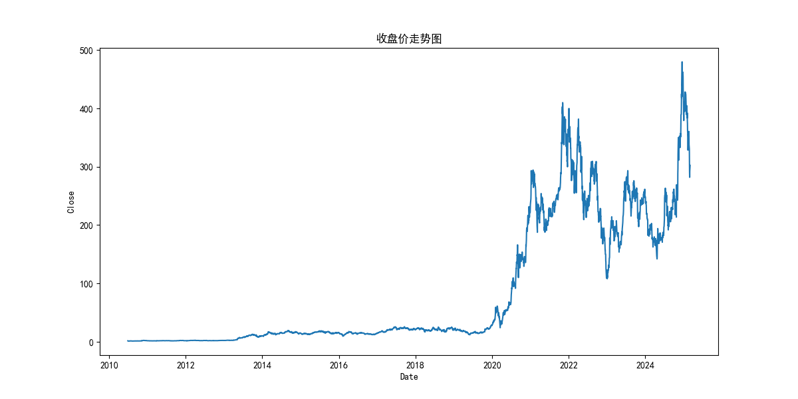
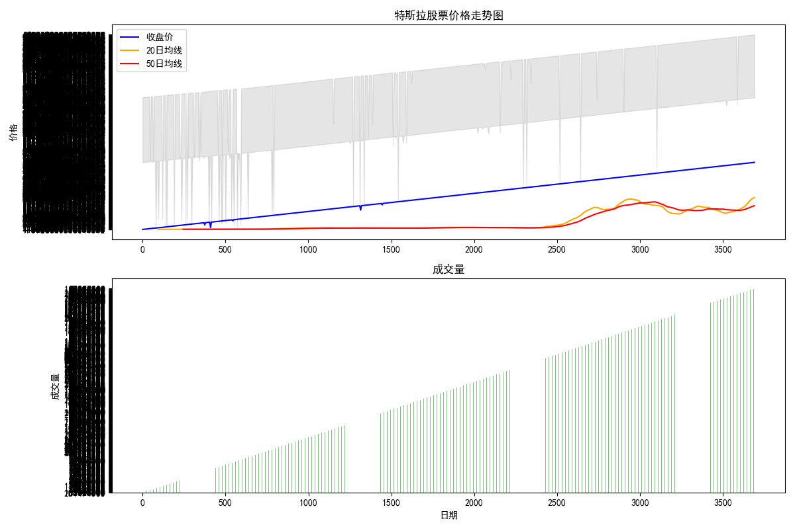
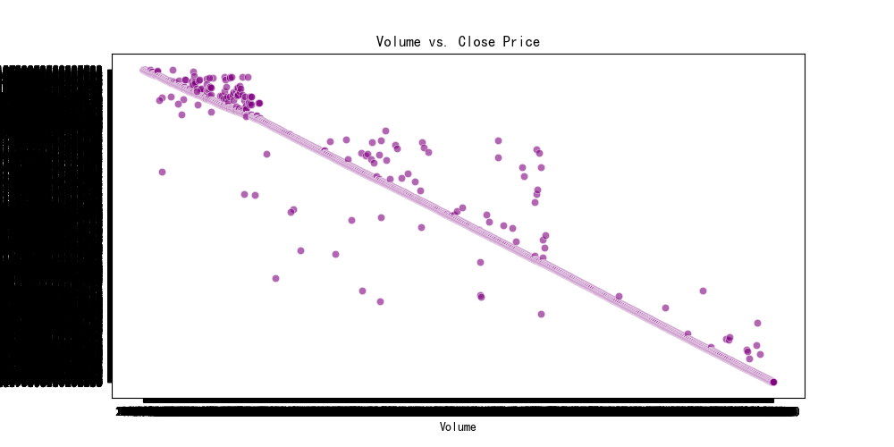
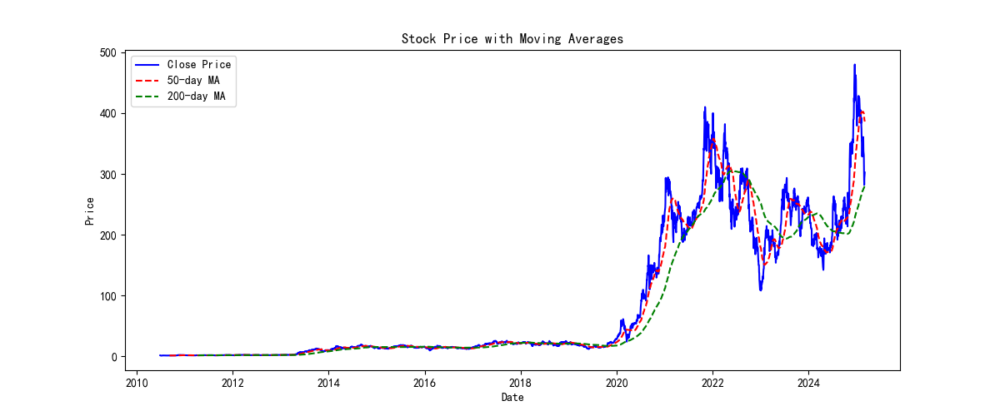
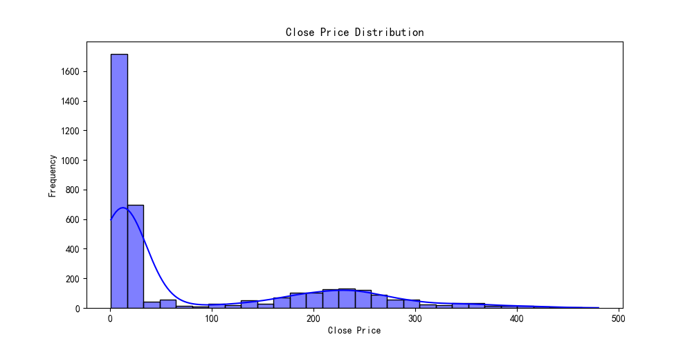
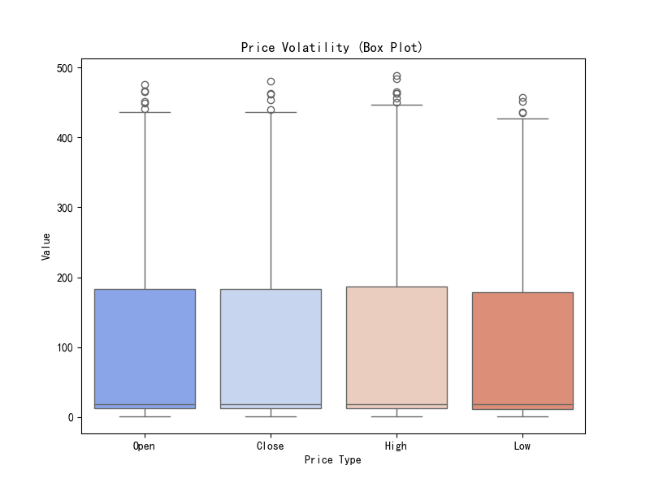
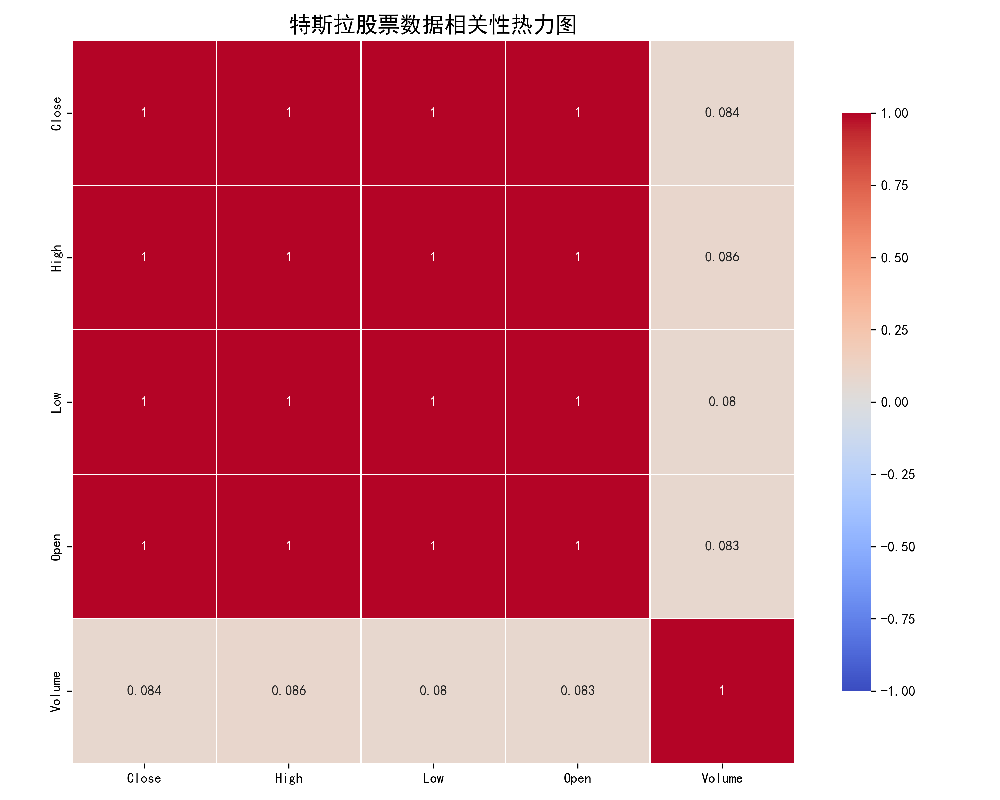

# 特斯拉股票数据分析与可视化项目

## 项目概述

本项目是一个数据挖掘与可视化应用，专注于特斯拉股票数据的分析和图形化展示。通过多种可视化图表和数据分析技术，帮助用户直观地理解特斯拉股票的历史表现、价格趋势和交易模式。



## 功能特点

- **多样化图表展示**：蜡烛图、走势图、散点图、热力图等多种可视化方式
- **技术指标分析**：移动平均线、价格分布、波动性分析等
- **相关性分析**：展示各价格指标和交易量之间的关系
- **词云可视化**：直观展示特斯拉股票相关关键词
- **详细的统计分析**：包括均值、中位数、标准差等统计指标

## 安装步骤

### 1. 克隆或下载项目

```bash
# 克隆项目到本地
git clone [项目地址]
# 或直接下载ZIP文件并解压
```

### 2. 安装依赖包

```bash
# 进入项目目录
cd 项目目录

# 安装所需依赖
pip install -r requirements.txt
```

### 3. 准备数据

确保`data`文件夹中包含`tesla_stock_data_2000_2025.csv`文件。如果没有，请将特斯拉股票数据文件放入该目录。

## 使用方法

### 运行主程序

```bash
python src/main.py
```

运行后，程序将：
1. 读取特斯拉股票数据
2. 生成各种可视化图表
3. 保存图表为PNG和HTML格式

### 查看可视化文档

程序运行完成后，可以通过以下方式查看结果：

1. 直接打开生成的PNG图片文件
2. 打开`visualization_documentation.html`查看完整的可视化文档
3. 查看`visualization_documentation.md`获取详细的分析说明

## 图表说明

### 1. 蜡烛图



展示特斯拉股票的价格走势，包括开盘价、收盘价、最高价和最低价。红色蜡烛表示上涨，绿色蜡烛表示下跌。

### 2. 交易量与收盘价散点图



展示交易量与收盘价之间的关系，帮助分析交易量与价格变动的相关性。

### 3. 收盘价走势图


展示特斯拉股票收盘价随时间的变化，可以清晰地显示长期趋势。

### 4. 移动平均线图



展示股票价格与50日和200日移动平均线的关系，帮助识别中长期趋势。

### 5. 价格分布直方图



展示特斯拉股票收盘价的频率分布，帮助分析价格的集中趋势和分散程度。

### 6. 价格波动箱线图



展示股票价格的波动情况，包括中位数、四分位数和异常值。

### 7. 相关性热力图



展示各价格指标和交易量之间的相关性强度，帮助分析变量间的关系。

### 8. 特斯拉股票词云图


直观展示与特斯拉股票相关的关键词及其重要性。

## 项目结构

```
项目目录/
├── data/                      # 数据文件夹
│   └── tesla_stock_data_2000_2025.csv  # 特斯拉股票数据
├── .github/                   # GitHub配置文件
│   └── workflows/             # GitHub Actions工作流
│       └── pylint.yml         # Python代码质量检查配置
├── src/                       # 源代码文件夹
│   ├── main.py                # 主程序文件
│   └── generate_documentation.py  # 文档生成脚本
├── images/                    # 图表文件夹
│   ├── candlestick_chart.png  # 蜡烛图
│   ├── close_price_trend.png  # 收盘价走势图
│   ├── correlation_heatmap.png # 相关性热力图
│   ├── moving_averages.png    # 移动平均线图
│   ├── price_distribution.png # 价格分布直方图
│   ├── price_volatility.png   # 价格波动箱线图
│   ├── tesla_wordcloud.png    # 特斯拉股票词云图
│   └── volume_vs_close.png    # 交易量与收盘价散点图
├── docs/                      # 文档文件夹
│   ├── visualization_documentation.html  # HTML格式的可视化文档
│   └── visualization_documentation.md    # Markdown格式的可视化文档
├── requirements.txt           # 项目依赖列表
└── README.md                  # 项目说明文档
```

## 依赖包

本项目使用以下主要Python库：

- **数据处理与分析**：numpy, pandas
- **数据可视化**：matplotlib, seaborn, plotly
- **机器学习**：scikit-learn, xgboost
- **词云生成**：wordcloud, jieba (中文分词)

详细依赖列表请参见`requirements.txt`文件。

## 注意事项

1. 确保安装了所有必要的依赖包
2. 运行程序需要Python 3.8或更高版本
3. 生成HTML格式的蜡烛图需要网络连接（用于加载plotly CDN）
4. 中文显示需要系统安装了中文字体（如SimHei）

## 扩展与自定义

- 可以修改`main.py`中的参数来调整图表样式和分析方法
- 可以替换数据文件分析其他股票
- 可以在现有代码基础上添加新的分析方法和可视化图表

## 贡献指南

欢迎对本项目进行改进和扩展！如果您有任何建议或想法，请：

1. Fork本项目
2. 创建您的特性分支 (`git checkout -b feature/AmazingFeature`)
3. 提交您的更改 (`git commit -m 'Add some AmazingFeature'`)
4. 推送到分支 (`git push origin feature/AmazingFeature`)
5. 开启一个Pull Request