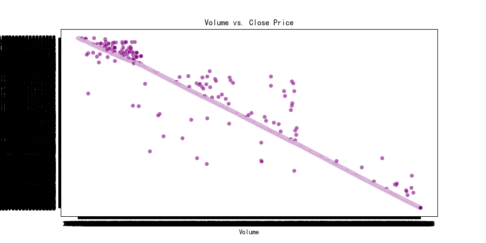
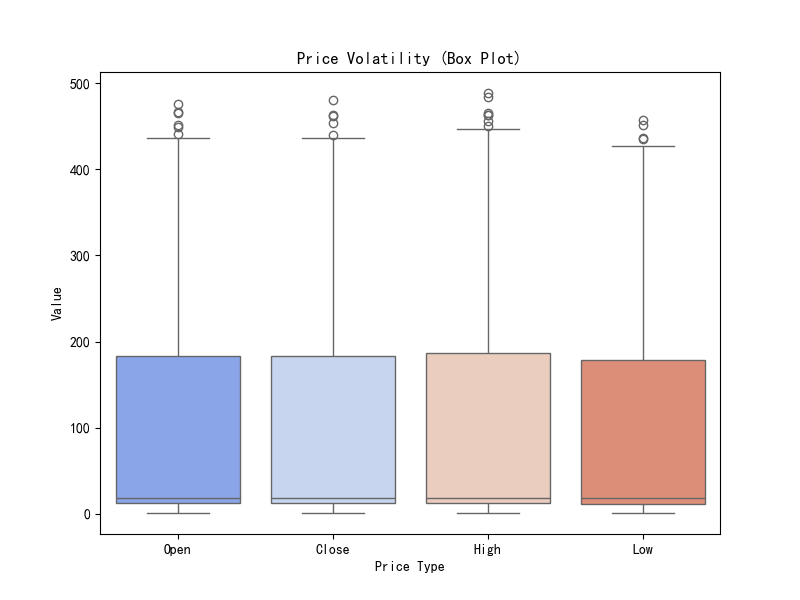

# 数据可视化文档

本文档详细记录了特斯拉股票数据分析过程中生成的各个图表，包括预处理步骤、统计学特征计算结果和可视化分析。

## 目录

1. [蜡烛图](#蜡烛图)
2. [交易量与收盘价散点图](#交易量与收盘价散点图)
3. [收盘价走势图](#收盘价走势图)
4. [移动平均线图](#移动平均线图)
5. [价格分布直方图](#价格分布直方图)
6. [价格波动箱线图](#价格波动箱线图)
7. [相关性热力图](#相关性热力图)
8. [特斯拉股票词云图](#特斯拉股票词云图)

## 统计学特征计算结果

```python
未找到相关代码
```

统计特征解释：
- **均值**：数据的平均值，反映数据的集中趋势
- **中位数**：将数据排序后的中间值，不受极端值影响
- **标准差**：反映数据的离散程度，值越大表示数据越分散
- **最小值/最大值**：数据的范围边界
- **分位数**：25%和75%分位数反映数据的分布特征
- **偏度**：描述分布的对称性，正值表示右偏，负值表示左偏
- **峰度**：描述分布的尖峰程度，值越大表示分布越尖锐

## 蜡烛图

### 预处理步骤和代码截图

```python
# 2. Candlestick Chart
# 使用plotly创建专业的蜡烛图
# 对数据进行采样以减小数据量，但保留足够的数据点以显示趋势
sample_size = 5  # 减小采样间隔以显示更多数据点
df_sampled = df.iloc[::sample_size].copy()

# 计算移动平均线
df_sampled['MA20'] = df_sampled['Close'].rolling(window=20).mean()
df_sampled['MA50'] = df_sampled['Close'].rolling(window=50).mean()

# 使用matplotlib创建替代的蜡烛图（作为备份）
plt.figure(figsize=(12, 8))
plt.subplot(2, 1, 1)  # 2行1列的第1个子图
plt.plot(df_sampled.index, df_sampled['Close'], label='收盘价', color='blue')
plt.plot(df_sampled.index, df_sampled['MA20'], label='20日均线', color='orange')
plt.plot(df_sampled.index, df_sampled['MA50'], label='50日均线', color='red')
plt.fill_between(df_sampled.index, df_sampled['Low'], df_sampled['High'], alpha=0.2, color='gray')
plt.title('特斯拉股票价格走势图')
plt.ylabel('价格')
plt.legend()

# 在第二个子图中添加成交量
plt.subplot(2, 1, 2)  # 2行1列的第2个子图
plt.bar(df_sampled.index, df_sampled['Volume'], color='green', alpha=0.5)
plt.title('成交量')
plt.xlabel('日期')
plt.ylabel('成交量')

plt.tight_layout()

# ... 更多代码省略 ...
```

### 可视化图表


### 分析

展示了特斯拉股票的价格走势，包括开盘价、收盘价、最高价和最低价。红色蜡烛表示上涨，绿色蜡烛表示下跌。

## 交易量与收盘价散点图

### 预处理步骤和代码截图

```python
# 3. Volume vs. Close Price Scatter Plot
plt.figure(figsize=(10, 5))
sns.scatterplot(x=df['Volume'], y=df['Close'], color="purple", alpha=0.6)
plt.title("Volume vs. Close Price")
plt.xlabel("Volume")
plt.ylabel("Close Price")
plt.savefig("volume_vs_close.png")
plt.close()
print("交易量与收盘价散点图已保存为volume_vs_close.png")
# 移除plt.show()调用

# 将第一列重命名为Date
```

### 可视化图表



### 分析

展示了交易量与收盘价之间的关系，帮助分析交易量与价格变动的相关性。

## 收盘价走势图

### 预处理步骤和代码截图

```python
plt.figure(figsize=(12,6))
sns.lineplot(data=df, x=df.index, y="Close")
plt.title("收盘价走势图")
plt.savefig("close_price_trend.png")
plt.close()
print("收盘价走势图已保存为close_price_trend.png")

# 4. Moving Averages
```

### 可视化图表


### 分析

展示了特斯拉股票收盘价随时间的变化，可以清晰地显示长期趋势。

## 移动平均线图

### 预处理步骤和代码截图

```python
# 4. Moving Averages
df["50_MA"] = df["Close"].rolling(window=50).mean()
df["200_MA"] = df["Close"].rolling(window=200).mean()

plt.figure(figsize=(12, 5))
plt.plot(df.index, df["Close"], label="Close Price", color="blue")
plt.plot(df.index, df["50_MA"], label="50-day MA", color="red", linestyle="dashed")
plt.plot(df.index, df["200_MA"], label="200-day MA", color="green", linestyle="dashed")
plt.legend()
plt.title("Stock Price with Moving Averages")
plt.xlabel("Date")
plt.ylabel("Price")
plt.savefig("moving_averages.png")
plt.close()
print("移动平均线图已保存为moving_averages.png")

# 5. Histogram for Price Distribution
```

### 可视化图表


### 分析

展示了股票价格与50日和200日移动平均线的关系，帮助识别中长期趋势。

## 价格分布直方图

### 预处理步骤和代码截图

```python
# 5. Histogram for Price Distribution
plt.figure(figsize=(10, 5))
sns.histplot(df["Close"], bins=30, kde=True, color="blue")
plt.title("Close Price Distribution")
plt.xlabel("Close Price")
plt.ylabel("Frequency")
plt.savefig("price_distribution.png")
plt.close()
print("价格分布直方图已保存为price_distribution.png")

# 6. Box Plot for Price Volatility
```

### 可视化图表


### 分析

展示了特斯拉股票收盘价的频率分布，帮助分析价格的集中趋势和分散程度。

## 价格波动箱线图

### 预处理步骤和代码截图

```python
# 6. Box Plot for Price Volatility
plt.figure(figsize=(8, 6))
sns.boxplot(data=df[['Open', 'Close', 'High', 'Low']], palette="coolwarm")
plt.title("Price Volatility (Box Plot)")
plt.xlabel("Price Type")
plt.ylabel("Value")
plt.savefig("price_volatility.png")
plt.close()
print("价格波动箱线图已保存为price_volatility.png")
# 移除plt.show()调用
```

### 可视化图表



### 分析

展示了开盘价、收盘价、最高价和最低价的分布情况，帮助分析价格的波动范围和异常值。

## 相关性热力图

### 预处理步骤和代码截图

```python
# 7. 相关性热力图
print("\n创建相关性热力图...")

# 选择数值型列进行相关性分析
corr_columns = ['Close', 'High', 'Low', 'Open', 'Volume']

# 计算相关性矩阵
correlation_matrix = df[corr_columns].corr()

# 创建热力图
plt.figure(figsize=(10, 8))
sns.heatmap(correlation_matrix, annot=True, cmap='coolwarm', vmin=-1, vmax=1, center=0,
           square=True, linewidths=.5, cbar_kws={"shrink": .8})
plt.title('特斯拉股票数据相关性热力图', fontsize=16)
plt.tight_layout()
plt.savefig('correlation_heatmap.png', dpi=300)
plt.close()
print("相关性热力图已保存为correlation_heatmap.png")

# 解释相关性热力图
```

### 可视化图表


### 分析

展示了各价格指标和交易量之间的相关性强度，帮助分析变量间的关系。

## 特斯拉股票词云图

### 预处理步骤和代码截图

```python
# 7. 生成词云
# 创建一个包含特斯拉股票相关词汇的文本
stock_text = """
特斯拉 股票 投资 分析 价格 趋势 波动 交易量 开盘价 收盘价 最高价 最低价 
电动汽车 新能源 科技股 马斯克 市值 增长 下跌 上涨 投资者 股东 
财报 季度 年度 预测 技术分析 基本面 阻力位 支撑位 均线 移动平均线 
市场 行情 大盘 板块 新能源汽车 电池技术 自动驾驶 人工智能 未来发展
"""

# 使用jieba进行中文分词
words = jieba.cut(stock_text)
text = " ".join(words)

# 创建词云对象
wordcloud = WordCloud(
    font_path='C:\\Windows\\Fonts\\simhei.ttf',  # 设置中文字体路径
    width=800, 
    height=400, 
    background_color='white',
    max_words=100,
    max_font_size=100,
    random_state=42
).generate(text)

# 显示词云图
plt.figure(figsize=(10, 6))
plt.imshow(wordcloud, interpolation='bilinear')
plt.axis('off')
plt.title('特斯拉股票相关词云')
plt.savefig('tesla_wordcloud.png', dpi=300)
# ... 更多代码省略 ...
```

### 可视化图表


### 分析

直观地展示了与特斯拉股票相关的高频词汇，反映了投资者关注的焦点。

